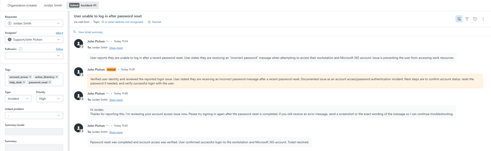
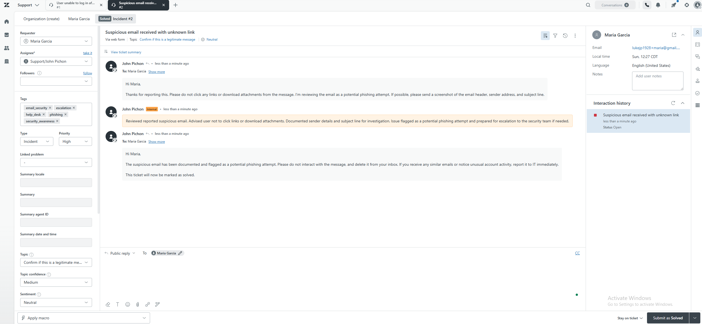
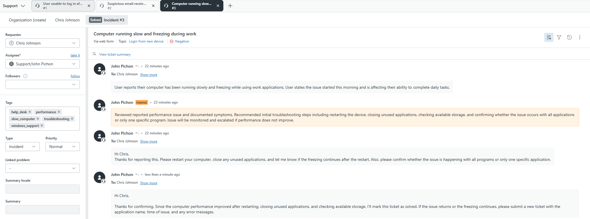
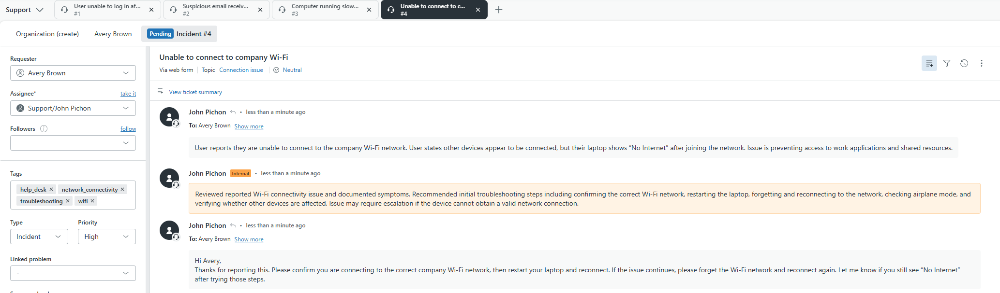
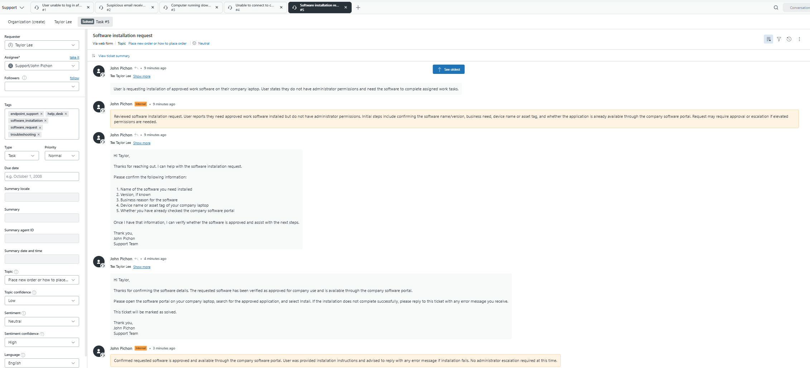

# Zendesk Help Desk Ticketing Project

## Overview

This project demonstrates a simulated Tier 1 help desk workflow using Zendesk. I created and managed multiple support tickets involving common IT support scenarios, including account access, phishing awareness, computer performance, Wi-Fi connectivity, and software installation requests.

The goal of this project was to practice documenting tickets, assigning priority, adding tags, writing internal notes, communicating with users, troubleshooting issues, and moving tickets through the support lifecycle in a professional help desk environment.

## Tools Used

- Zendesk
- Ticket management
- Internal notes
- Public replies
- Incident and task classification
- Troubleshooting documentation
- End-user communication

## Skills Demonstrated

- Help desk ticket triage
- Customer support communication
- Password reset and account access support
- Phishing email handling and escalation awareness
- Computer performance troubleshooting
- Wi-Fi connectivity troubleshooting
- Software installation request handling
- Documentation of troubleshooting steps
- Ticket status management

## Ticket Scenarios

### Ticket 1: User Unable to Log In After Password Reset

**Issue:**  
A user was unable to log in after a recent password reset and reported receiving an incorrect password message.

**Actions Taken:**

- Verified the reported login issue
- Documented the issue with an internal note
- Provided user-facing troubleshooting instructions
- Confirmed successful access after resolution
- Marked the ticket as solved

**Screenshot:**  

---

### Ticket 2: Suspicious Email Received

**Issue:**  
A user reported receiving a suspicious email from an unknown sender containing a link.

**Actions Taken:**

- Advised the user not to click links or download attachments
- Documented the suspicious email report
- Tagged the ticket for phishing/security awareness
- Prepared the ticket for escalation if needed
- Marked the ticket as solved after user guidance was provided

**Screenshot:**  

---

### Ticket 3: Computer Running Slow and Freezing

**Issue:**  
A user reported that their computer was running slowly and freezing while using work applications.

**Actions Taken:**

- Documented reported performance symptoms
- Recommended initial troubleshooting steps
- Asked whether the issue affected all applications or only one program
- Provided user-facing support instructions
- Marked the ticket as solved after the performance issue improved

**Screenshot:**  

---

### Ticket 4: Unable to Connect to Company Wi-Fi

**Issue:**  
A user reported that their laptop connected to the company Wi-Fi but displayed “No Internet,” while other devices appeared to be connected.

**Actions Taken:**

- Documented Wi-Fi connectivity symptoms
- Recommended confirming the correct Wi-Fi network
- Advised restarting the laptop
- Recommended forgetting and reconnecting to the Wi-Fi network
- Asked the user to confirm whether the “No Internet” message still appeared
- Moved the ticket to Pending while waiting for the user’s response

**Status:** Pending

**Screenshot:**  

---

### Ticket 5: Software Installation Request

**Issue:**  
A user requested installation of approved work software but did not have administrator permissions on their company laptop.

**Actions Taken:**

- Documented the software installation request
- Asked for software name, version, business reason, and device details
- Verified that the software was approved and available through the company software portal
- Provided installation instructions
- Marked the ticket as solved

**Screenshot:**  

---

## What I Learned

This project helped me practice the daily responsibilities of a Tier 1 help desk technician. I learned how to document issues clearly, communicate professionally with users, use internal notes, organize tickets with tags and priorities, and move tickets through the support lifecycle from open to pending to solved.

## Project Outcome

Completed a five-ticket simulated Zendesk help desk workflow covering common entry-level IT support scenarios.
